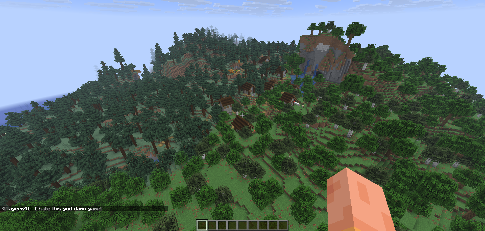
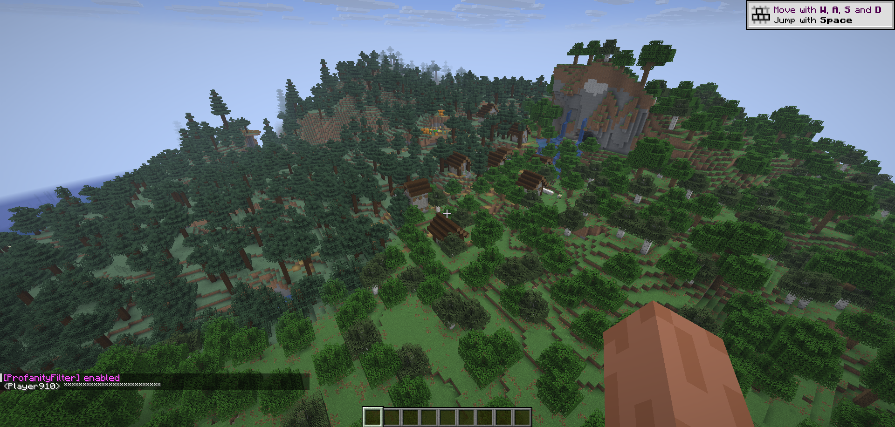

# ProfanityFilterer For Minecraft 1.21.11

This is a simple profanity filter plugin for Minecraft version 1.21.11. It helps to keep the chat clean by filtering out offensive words and phrases.

# Building the Mod
1. Clone the repository to your local machine.
2. Open the project in your preferred Java IDE (e.g., IntelliJ IDEA, Eclipse)
3. Make sure you have the Minecraft Forge development environment set up for version 1.21.11.
4. Build the project using your IDE's build tools or by running the appropriate Gradle commands

# Installation
1. Download the compiled JAR file from the releases section of this repository.
2. Place the JAR file into the `mods` folder of your Minecraft installation.
3. Launch Minecraft with the Forge profile for version 1.21.11.

# Usage
Once the mod is installed, use the command `/toggleProfanityFilter` in the chat to enable or disable the profanity filter. The filter will automatically block any offensive words or phrases defined in the configuration.

# Example

Before being enabled: 

After being enabled: 

